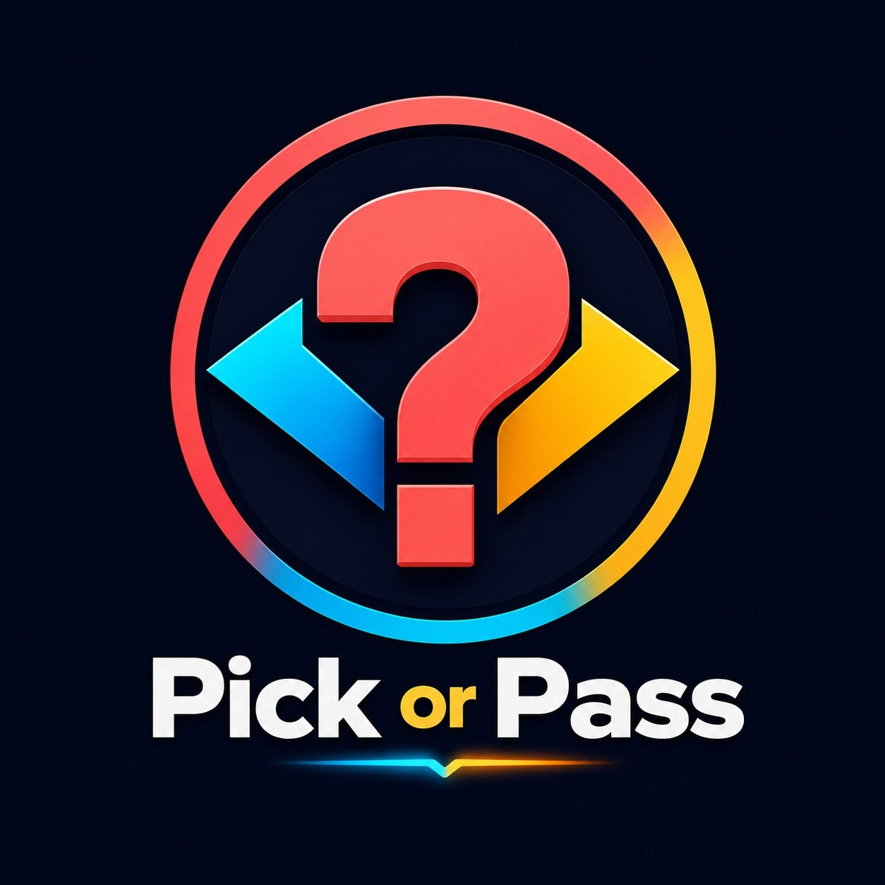

# ⚡ Pick or Pass

> Um dilema por dia. Escolha. Debata. Descubra quem você é.



## 🎯 O que é?

**Pick or Pass** é um app social de dilemas diários. Todo dia você recebe UM dilema moral, filosófico ou engraçado. Você escolhe A ou B, vê o que seus amigos escolheram, e descobre seu "perfil moral" ao longo do tempo.

### Por que viraliza?
- 🧠 **Serotonina gamificada** — cada ação libera pontos de recompensa
- 👥 **Interação social** — veja o que seus amigos escolheram
- 📤 **Compartilhamento nativo** — stories, WhatsApp, Twitter
- 🔥 **Streaks** — sequências diárias que viciam
- 🏆 **Rankings** — competição saudável entre amigos

## 📁 Estrutura do Projeto

```
pickorpass-app/
├── index.html          # App completo (HTML + CSS + JS)
├── logo.jpg            # Logo principal (108 KB)
├── logo-small.jpg      # Logo para header (7 KB)
├── logo-180.jpg        # Ícone PWA 180x180 (9 KB)
└── logo-64.jpg         # Favicon 64x64 (2 KB)
```

## 🚀 Como usar localmente

1. Baixe todos os arquivos desta pasta
2. Abra `index.html` no navegador (Chrome/Edge/Safari)
3. Para testar no celular:
   - Use "Live Server" no VS Code, OU
   - Suba no GitHub Pages (veja abaixo)

## 🌐 Como publicar no GitHub Pages

### Opção 1: Upload manual (mais fácil)

1. Vá em **Settings** → **Pages** no seu repositório
2. Em "Source", selecione **Deploy from a branch**
3. Selecione a branch `main` e pasta `/ (root)`
4. Clique em **Save**
5. Seu app estará em: `https://robertasousa-dev.github.io/Pick-or-Pass-/`

### Opção 2: Via Git (terminal)

```bash
# Clone seu repositório
git clone https://github.com/robertasousa-dev/Pick-or-Pass-.git
cd Pick-or-Pass-

# Copie os arquivos do app para a pasta
# (cole os arquivos da pasta pickorpass-app aqui)

# Suba para o GitHub
git add .
git commit -m "🚀 Primeira versão do Pick or Pass"
git push origin main
```

### Opção 3: GitHub Desktop

1. Baixe o [GitHub Desktop](https://desktop.github.com/)
2. Clone seu repositório
3. Arraste os arquivos para a pasta
4. Escreva a mensagem de commit
5. Clique em "Commit to main" → "Push origin"

## 🎨 Paleta de Cores (Dopaminérgica)

| Cor | Hex | Uso |
|-----|-----|-----|
| Coral Red | `#ff6b6b` | Primária, CTAs, destaque |
| Golden Yellow | `#feca57` | Streaks, recompensas, gradiente |
| Cyan Blue | `#48dbfb` | Opção B, alternativa, frescor |
| Deep Navy | `#0f0f1a` | Background principal |
| Soft Purple | `#a29bfe` | Perfil, personalidade |

## 📱 Telas do App

1. **Splash** — Logo animado + botões de entrada
2. **Home** — Dilema do dia + opções A/B
3. **Resultados** — Gráficos + comentários + compartilhar
4. **Amigos** — Squad + ranking de amigos
5. **Ranking Global** — Pódio + top 100
6. **Perfil** — Estatísticas + badges + personalidade

## 🔮 Próximos passos

- [ ] Backend com Firebase (autenticação, banco, real-time)
- [ ] Sistema de dilemas diários reais
- [ ] Push notifications
- [ ] Modo "Duelo" 1v1 com amigos
- [ ] Loja de skins/avatars
- [ ] Planos Pro (sem anúncios, dilemas extras)

---

Feito com ⚡ e muita serotonina.
